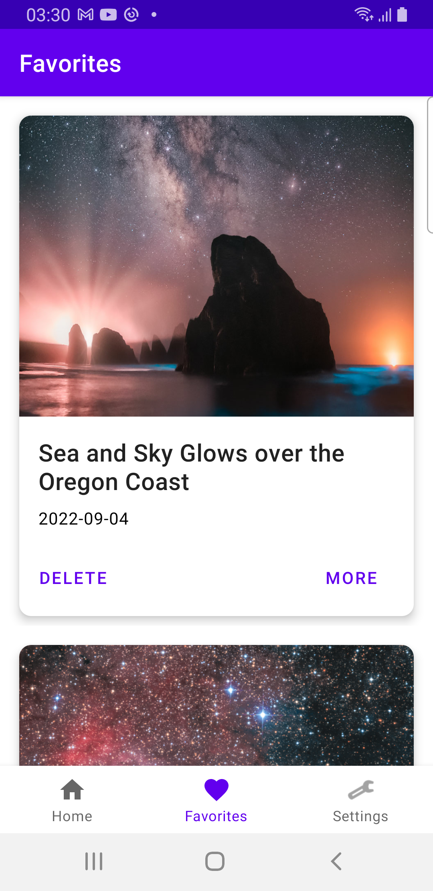

# Astronomy Picture of the Day
https://apod.nasa.gov/apod/astropix.html

## Key Features
- Allow users to search for the picture for a date of their choice
- Allow users to create/manage a list of &quot;favorite&quot; listings
- Display date, explanation, Title and the image / video of the day
- Dark mode support
- Handle different screen sizes, orientations

## Screenshots

## Architecture Components
- MVVM with clean Architecture
- Retrofit
- Dagger
- ViewModel
- View Binding
- Data Binding
- LiveData
- Coroutines
- Room
- Coil
- Navigation Component